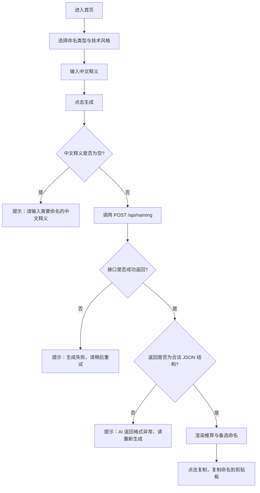

## 1. 产品概述
Naming Copilot 是一个面向程序员的命名小工具：用户选择命名类型与技术风格，输入中文释义，即可生成专业、工程化、可落地的英文命名建议。
- 解决“命名耗时/不专业/不一致”的痛点，输出带理由与评分的候选命名，提升研发效率与可读性。

## 2. 核心功能

### 2.1 用户角色
本 MVP 不区分用户角色：所有访客均可直接使用。

### 2.2 功能模块
1. **首页**：选择命名类型、输入中文释义、选择技术风格、生成命名建议、复制结果。
2. **服务端命名接口**：接收请求参数，调用 OpenAI，返回结构化 JSON 结果，包含推荐/备选/解释/警告。

### 2.3 页面详情
| 页面名称 | 模块名称 | 功能描述 |
|---------|---------|---------|
| / | 标题区 | 标题“Naming Copilot”，副标题“输入中文释义，生成专业英文程序命名。” |
| / | 输入表单 | 命名类型选择、中文释义输入、技术风格选择、生成按钮；空输入提示与错误提示 |
| / | 结果区 | 展示推荐命名与备选命名；每条命名包含理由、评分、复制按钮；按评分显示标签文案 |

## 3. 核心流程
用户从首页输入中文释义并生成命名建议：



## 4. 交互与校验规则
### 4.1 初始状态
- type = "variable"
- style = "frontend"
- description = ""
- result = null
- loading = false
- error = null

### 4.2 点击生成
1. 校验 description 非空（去掉首尾空格后）
2. loading = true，清空 error
3. POST /api/naming
4. 成功：展示结果
5. 失败：展示错误提示
6. finally：loading = false

### 4.3 错误处理（MVP 必须）
需要覆盖：
1. 中文释义为空
2. OpenAI API 请求失败
3. 返回结果不是合法 JSON
4. 网络错误
5. 用户输入太短或过于模糊（用 warnings 呈现）

错误提示示例：
- 请输入需要命名的中文释义。
- 生成失败，请稍后重试。
- AI 返回格式异常，请重新生成。

## 5. 命名类型与技术风格

### 5.1 命名类型
```ts
export const namingTypes = [
  { label: "项目名", value: "project" },
  { label: "组件名", value: "component" },
  { label: "CSS 类名", value: "cssClass" },
  { label: "变量名", value: "variable" },
  { label: "方法名", value: "function" },
  { label: "类名", value: "class" },
  { label: "API 方法名", value: "api" },
  { label: "Hook / Composable", value: "hook" }
] as const
```

### 5.2 技术风格
```ts
export const namingStyles = [
  { label: "通用前端", value: "frontend" },
  { label: "React", value: "react" },
  { label: "Vue", value: "vue" },
  { label: "Node.js", value: "node" },
  { label: "Java", value: "java" },
  { label: "Python", value: "python" },
  { label: "企业项目风格", value: "enterprise" },
  { label: "简洁风格", value: "concise" }
] as const
```

## 6. UI 设计要求
### 6.1 视觉风格
- 简洁“开发者工具”风格
- 桌面端左右两栏：左侧表单、右侧结果；移动端上下布局

### 6.2 结果卡片规则
- 推荐命名用更大字号突出
- 每个候选命名旁边有复制按钮
- score >= 9：显示“强烈推荐”
- score 7-8：显示“可选”
- score <= 6：显示“谨慎使用”

## 7. 验收标准
必须满足：
1. 用户可以选择命名类型
2. 用户可以选择技术风格
3. 用户输入中文释义后可以生成英文命名
4. 返回 1 个推荐命名和至少 3 个备选命名
5. 每个命名都有中文理由和评分
6. 支持复制命名
7. API Key 只存在服务端
8. 页面在移动端可用
9. 空输入有提示
10. 请求失败有提示

## 8. 测试用例（验收参考）
用例 1：
- 类型：组件名；释义：用户个人资料卡片；风格：React
- 期望：UserProfileCard / ProfileCard / UserInfoCard

用例 2：
- 类型：变量名；释义：当前选中的商品；风格：通用前端
- 期望：selectedProduct / currentProduct / activeProduct

用例 3：
- 类型：方法名；释义：获取订单列表；风格：通用前端
- 期望：fetchOrderList / getOrderList / loadOrders

用例 4：
- 类型：变量名；释义：是否已经登录；风格：React
- 期望：isLoggedIn / isAuthenticated / hasLoggedIn

用例 5：
- 类型：CSS 类名；释义：登录表单错误信息；风格：通用前端
- 期望：login-form-error-message / login-error-message / form-error-message

