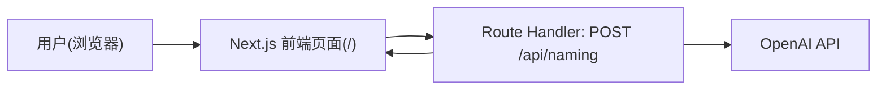

## 1. 架构设计



关键原则：

* OpenAI API Key 仅在服务端读取（环境变量），不下发到浏览器

* API 返回严格 JSON 结构，前端按类型渲染并支持复制

## 2. 技术选型说明

* 前端框架：Next.js（App Router）

* 语言：TypeScript

* 样式：Tailwind CSS

* UI 组件：shadcn/ui（基于 Radix）

* 服务端接口：Next.js Route Handlers（app/api/\*\*/route.ts）

* 大模型：OpenAI（默认模型：gpt-4.1，可配置）

## 3. 路由定义

| 路由 | 用途              |
| -- | --------------- |
| /  | 单页工具：输入表单 + 结果区 |

## 4. API 定义

### 4.1 接口

* 方法：POST

* 路径：/api/naming

* 内容类型：application/json

### 4.2 TypeScript 类型

```ts
export type NamingType =
  | "project"
  | "component"
  | "cssClass"
  | "variable"
  | "function"
  | "class"
  | "api"
  | "hook"

export type NamingStyle =
  | "frontend"
  | "react"
  | "vue"
  | "node"
  | "java"
  | "python"
  | "enterprise"
  | "concise"

export type NamingRequest = {
  type: NamingType
  description: string
  style: NamingStyle
}

export type NamingSuggestion = {
  name: string
  reason: string
  score: number
}

export type NamingResponse = {
  recommended: NamingSuggestion
  alternatives: NamingSuggestion[]
  explanation: string
  warnings?: string[]
}
```

### 4.3 失败返回约定

* 400：请求体不合法或 description 为空

* 500：OpenAI 请求失败、解析失败、未知错误

返回体建议统一：

```ts
{ error: string }
```

## 5. 服务端实现结构（建议）

在 Route Handler 内做“薄控制器”，将可复用逻辑拆到 lib：

* lib/prompt.ts：构建 prompt（含命名规则与 JSON 输出约束）

* lib/openai.ts：OpenAI 客户端初始化（读取 OPENAI\_API\_KEY）

* lib/parse-json.ts：从模型返回文本中提取/解析 JSON，并做结构校验

## 6. Prompt 约束（核心）

目标：产出“真实工程中可用”的命名，而不是逐字直译。

输出要求：

* 只输出 JSON

* 1 个 recommended + 3-5 个 alternatives

* 每个候选含中文 reason 与 score(1-10)

* 如果输入过短/含糊，用 warnings 说明不确定性

命名约定：

* project：可读的产品化英文名（PascalCase 或简洁组合词）

* component：PascalCase

* cssClass：kebab-case

* variable：camelCase

* function：camelCase，verb + object

* class：PascalCase

* api：camelCase，get/create/update/delete/fetch/upload/send + resource

* hook：以 use 开头，use + camelCase/PascalCase

## 7. 环境变量

* OPENAI\_API\_KEY=your\_api\_key

## 8. 目录结构（目标）

```txt
app/
  page.tsx
  api/
    naming/
      route.ts

components/
  NamingForm.tsx
  NamingResult.tsx
  CopyButton.tsx

lib/
  naming-options.ts
  openai.ts
  prompt.ts

types/
  naming.ts
```

